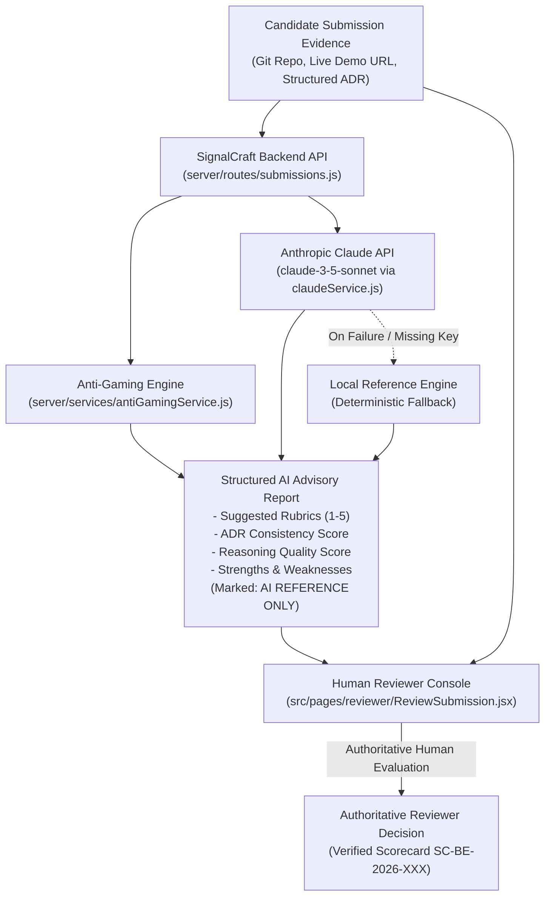

# AI in SignalCraft

## 1. Purpose

SignalCraft incorporates Artificial Intelligence specifically as an **analytical assistant for technical verification**. In engineering hiring, evaluating project code and architectural reasoning across dozens of candidates is cognitively demanding and time-consuming for peer reviewers. 

AI is employed to:
- Accelerate evidence inspection by extracting key architectural claims from candidate Architecture Decision Records (ADRs).
- Detect suspicious template matches, boilerplate stuffing, or LLM-generated disclaimers.
- Provide objective reference rubrics and constructive feedback points.

### The Core Principle
> **AI assists. Humans verify.**

AI is strictly an assistive reference layer. **AI never makes hiring, verification, or rejection decisions.** In SignalCraft, authoritative judgment belongs entirely to qualified human reviewers.

---

## 2. AI Architecture

Candidate submissions flow through automated checks and the Claude AI layer before reaching the human reviewer's console:



---

## 3. Claude Integration

The integration with Anthropic's Claude API is implemented directly in [`server/services/claudeService.js`](file:///c:/Users/Nayana%20k%20l/OneDrive/Documents/Hackmysore1.0/server/services/claudeService.js).

### Specifications
- **Model**: `claude-3-5-sonnet-20241022`
- **Endpoint**: `https://api.anthropic.com/v1/messages`
- **Environment Variable**: `ANTHROPIC_API_KEY` (configured in `server/.env`)
- **Headers**:
  - `x-api-key`: Server-side API key
  - `anthropic-version`: `2023-06-01`
  - `content-type`: `application/json`
- **Trigger Endpoints**:
  - `POST /api/submissions/:id/ai-analysis`: Triggers Claude analysis on a specific submission.
  - Automatically invoked upon project submission via `POST /api/submissions`.

### Request & Response Protocol
The backend constructs a strict principal-architect system prompt and supplies the candidate's challenge specifications, timed assessment answers, Git repository URL, live project URL, and structured ADR fields (`what`, `why`, `alternatives`, `tradeoffs`, `scaling`).

Claude returns a structured JSON payload parsed into:
```json
{
  "suggested_rubrics": {
    "correctness": 4.5,
    "architecture": 4.2,
    "code_quality": 4.0,
    "tradeoff_awareness": 4.5
  },
  "overall_suggested_score": 86,
  "adr_consistency": 88,
  "reasoning_quality": 84,
  "detected_strengths": ["Clear concurrency isolation via database row locks."],
  "detected_weaknesses": ["Recommend connection pool saturation alerts under burst loads."],
  "adr_critique": "Solid justification of pessimistic write locking over optimistic retries.",
  "anti_gaming_observations": "Authentic engineering vocabulary with zero boilerplate stuffing.",
  "summary": "High code modularity; ADR matches implementation."
}
```

### Mandatory Labeling
Every output payload returned by `claudeService.js` explicitly injects:
- `notice: 'AI Reference Only'`
- `authoritative: false`
- `reviewer_notice: 'Reviewer score is authoritative.'`

---

## 4. ADR Analysis

Architectural Decision Records (ADRs) document why a candidate made specific structural choices. Claude analyzes ADR evidence across five dimensions:

1. **Problem Understanding**: Does the candidate demonstrate an accurate understanding of non-functional constraints (e.g., high concurrency, idempotency, data consistency)?
2. **Design Decisions**: Are the chosen technologies, patterns, and boundaries suited to the challenge?
3. **Alternatives Considered**: Did the candidate evaluate viable alternative approaches (e.g., optimistic vs. pessimistic locking, Kafka vs. synchronous REST)?
4. **Trade-off Awareness**: Does the candidate acknowledge real trade-offs (e.g., lock latency vs. ACID guarantees, eventual consistency overhead)?
5. **Technical Reasoning & Code Alignment**: Does the submitted codebase actually implement the patterns defended in the ADR?

### Prominent AI Reference Labeling
In the reviewer interface ([`src/pages/reviewer/ReviewSubmission.jsx`](file:///c:/Users/Nayana%20k%20l/OneDrive/Documents/Hackmysore1.0/src/pages/reviewer/ReviewSubmission.jsx)), these insights are labeled:

> **AI REFERENCE ONLY**  
> *This critique is generated to assist review. It does not replace human evaluation or constitute an official evaluation.*

---

## 5. Similarity & Anti-Gaming Detection

Implemented in [`server/services/antiGamingService.js`](file:///c:/Users/Nayana%20k%20l/OneDrive/Documents/Hackmysore1.0/server/services/antiGamingService.js), the anti-gaming system protects the integrity of the evaluation process:

### Content Analyzed
- Candidate recorded assessment answers
- ADR submission text (`what`, `why`, `alternatives`, `tradeoffs`, `scaling`)
- Cross-submission token matching against previous cohort submissions stored in the SQLite database

### Similarity Representation
- **Jaccard Token Similarity**: Normalized percentage score ($0–100\%$) measuring overlap against past cohort submissions.
- **Originality Score**: Calculated as $100 - \text{similarity\_score}$.
- **Detection Flags**:
  - `HIGH_SIMILARITY_FLAGGED`: Cross-submission token overlap exceeding $70\%$.
  - `LLM_PROMPT_ARTIFACT_DETECTED`: Common AI disclaimer phrases (e.g., *"As an AI language model..."*, *"Certainly, here is..."*).
  - `GENERIC_ADR_SUPERFICIAL`: Superficial buzzwords without concrete engineering mechanics.
  - `LOW_SIMILARITY_ORIGINAL`: Clean, authentic syntax with distinct implementation vocabulary.

### Flagged Cases Do NOT Auto-Reject Candidates
A similarity or AI artifact flag updates `submissions.integrity_status` to `'FLAGGED'`, but **never automatically disqualifies a candidate**. 

The flag highlights the submission in the Reviewer Queue with an alert badge. The human reviewer inspects the flagged code and ADR to determine whether the similarity represents legitimate standard boilerplate (e.g., framework bootstrap code) or genuine academic dishonesty.

---

## 6. Challenge Variant Generation

To prevent solution leakage across candidates, SignalCraft supports domain challenge variations:

- **Variant Seeds**: Each domain challenge in [`server/db.js`](file:///c:/Users/Nayana%20k%20l/OneDrive/Documents/Hackmysore1.0/server/db.js) has alternative scenarios seeded in the `challenge_variants` table.
- **Equivalent Technical Scope**: Variants modify the application domain or specific constraint while maintaining identical skill difficulty:
  - *Challenge 1 (Variant A)*: High-Throughput Pessimistic Locking (E-commerce Order Processing)
  - *Challenge 1 (Variant B)*: Event-Driven Kafka Outbox Pattern (Financial Transaction Dispatch)
  - *Challenge 2 (Variant A)*: State Management & Virtualized Feeds (Real-time Analytics Dashboard)
- **Impact**: Candidates cannot copy implementations from previous cohort participants because scenarios, entity boundaries, and trade-off requirements differ.

---

## 7. AI Reference Scoring

Claude provides an advisory pre-score to give reviewers an initial point of orientation. However, the human reviewer's evaluation is solely authoritative.

### Example Scoring Journey
1. **Claude AI Advisory Pre-Score**:
   - Suggested Rubrics: Correctness: 4.5, Architecture: 4.2, Code Quality: 4.0, Trade-offs: 4.5
   - Overall AI Reference Score: **84 / 100** (`AI Reference Only`)
2. **Human Reviewer Evaluation**:
   - Correctness: 4.0
   - Architecture: 3.8
   - Code Quality: 4.0
   - Trade-off Awareness: 3.5
   - Reviewer Overall Score: **76 / 100**
3. **Final Verified Score**:
   - The verified scorecard records **76 / 100** as the authoritative review score.
   - The composite verified scorecard combines the candidate's assessment score ($40\%$) and the human review score ($60\%$).
   - **The AI reference score of 84 is completely discarded for final credentialing and ranking.**

---

## 8. AI Failure Handling & Resilience

The AI subsystem is engineered for complete fault tolerance:

| Failure Scenario | System Handling | Review Flow Impact |
| :--- | :--- | :--- |
| **`ANTHROPIC_API_KEY` Missing** | Logs warning; activates internal fallback reference engine. | **Zero interruption**: Reviewer sees deterministic reference notes. |
| **Claude API Timeout** | Catches network exception; falls back to local engine. | **Zero interruption**: Candidate submission still succeeds. |
| **Rate Limit / HTTP 429** | Catches HTTP error; logs notice; serves cached or fallback analysis. | **Zero interruption**: Queue remains operational. |
| **Malformed JSON Response** | Regex extraction handles Markdown blocks; defaults to safe schema on parse error. | **Zero interruption**: Prevents server crashes. |
| **Complete Upstream Outage** | Full manual fallback mode: human reviewer conducts review without AI assistance. | **Human review proceeds normally.** |

The backend server never crashes or hangs due to third-party AI provider interruptions.

---

## 9. Privacy & Security

- **Server-Side Key Isolation**: The `ANTHROPIC_API_KEY` is loaded exclusively via `process.env` in [`server/services/claudeService.js`](file:///c:/Users/Nayana%20k%20l/OneDrive/Documents/Hackmysore1.0/server/services/claudeService.js). It is never sent to the client application or bundled in frontend Vite assets.
- **Git Secrets Prevention**: `.env` and `.env.*` files are explicitly excluded by [`.gitignore`](file:///c:/Users/Nayana%20k%20l/OneDrive/Documents/Hackmysore1.0/.gitignore).
- **Untrusted Input Sanitation**: Candidate submissions and ADR text are serialized into structured JSON user prompts to prevent prompt injection from modifying system instructions.
- **Advisory Output Sanitation**: AI outputs are validated against numeric ranges ($1.0–5.0$) and string limits before saving to SQLite.

---

## 10. AI Limitations

1. **Hallucinations & Context Blindness**: AI models can misinterpret idiomatic patterns or misjudge nuanced framework features as errors.
2. **Non-Authoritative Status**: AI evaluations carry zero accreditation weight in SignalCraft.
3. **False Positives in Similarity**: Standard framework boilerplate, configuration files, and common library imports can trigger elevated similarity scores.
4. **Dependence on Evidence Quality**: AI critique is only as good as the submitted code repository and ADR detail. Brief or incomplete ADRs will yield generic observations.
5. **Human Review Is Indispensable**: A human engineer with domain expertise remains essential to assess architecture, code clarity, and practical competence.

---

## 11. AI Decision Boundary

| Task | AI Role | Human Role |
| :--- | :---: | :---: |
| **ADR Trade-off Analysis** | Generates advisory critique | Reviews critique and inspects code |
| **Similarity & Plagiarism Detection** | Computes overlap & flags patterns | Inspects flagged evidence; decides validity |
| **Challenge Variant Generation** | Generates alternative scenarios | Validates challenge balance and fairness |
| **Reference Scoring** | Suggests preliminary rubrics (1–5) | **Solely authoritative** for final rubric scores |
| **Final Candidate Verification** | **No role** | **Sole authority** (Signs 2-year scorecard) |
| **Hiring Decision** | **No role** | **Recruiter / Hiring Team authority** |

---

## 12. Verification & File References

- **AI Service**: [`server/services/claudeService.js`](file:///c:/Users/Nayana%20k%20l/OneDrive/Documents/Hackmysore1.0/server/services/claudeService.js)
- **Anti-Gaming Service**: [`server/services/antiGamingService.js`](file:///c:/Users/Nayana%20k%20l/OneDrive/Documents/Hackmysore1.0/server/services/antiGamingService.js)
- **Submission Endpoints**: [`server/routes/submissions.js`](file:///c:/Users/Nayana%20k%20l/OneDrive/Documents/Hackmysore1.0/server/routes/submissions.js)
- **Reviewer Console**: [`src/pages/reviewer/ReviewSubmission.jsx`](file:///c:/Users/Nayana%20k%20l/OneDrive/Documents/Hackmysore1.0/src/pages/reviewer/ReviewSubmission.jsx)
- **Database Schema**: [`server/db.js`](file:///c:/Users/Nayana%20k%20l/OneDrive/Documents/Hackmysore1.0/server/db.js)
