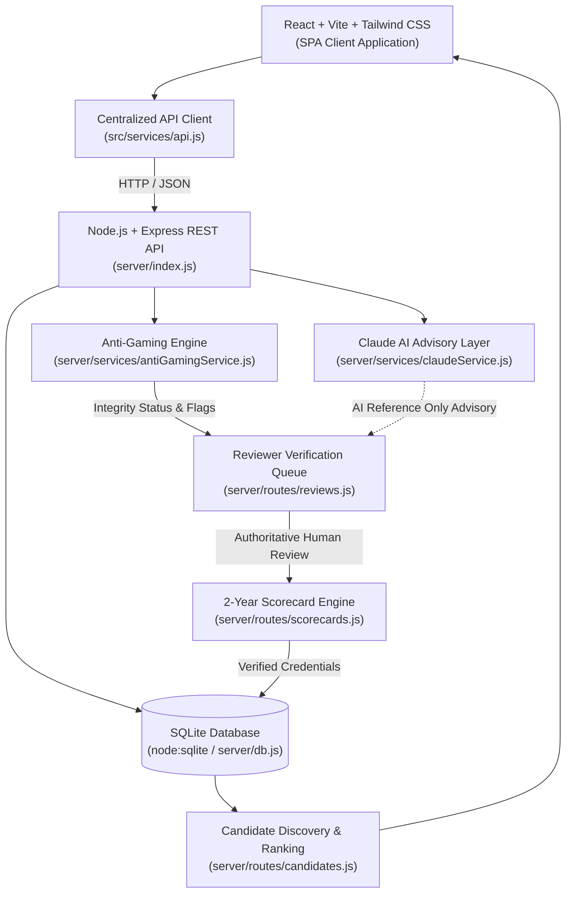
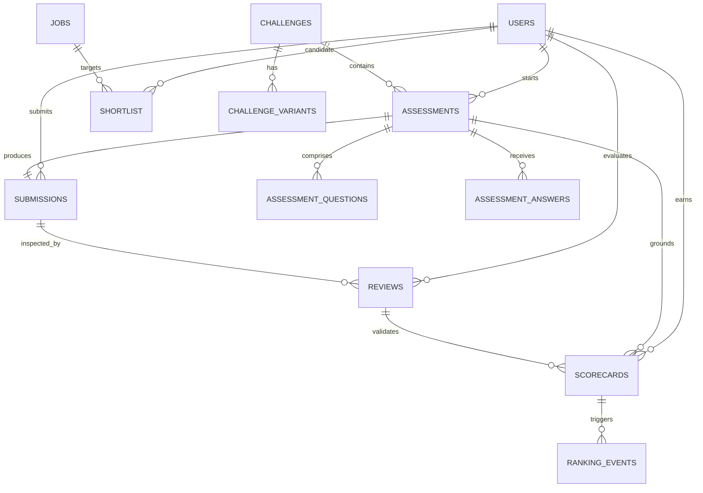
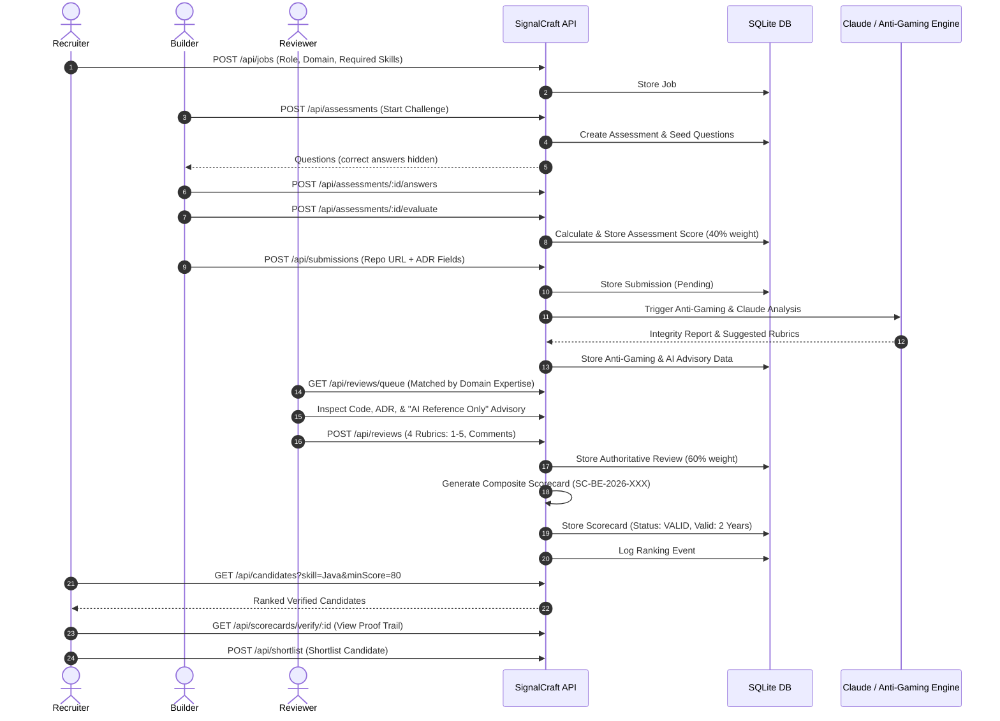

# SignalCraft Architecture

## 1. System Overview

SignalCraft is a **technical capability verification layer** for engineering hiring. Rather than evaluating engineers based on resume claims, keyword density, or leetcode trivia, SignalCraft provides an evidence-based pipeline where candidates demonstrate verified competence through practical problem solving, real project implementation, and Architectural Decision Records (ADRs).

### Core Flow
```text
BUILD → EXPLAIN → VERIFY → REVIEW → RANK → HIRE
```

### Role Model
- **Builder** $\rightarrow$ **Proves**: Completes timed technical assessments, implements functional projects, and documents trade-offs in structured ADRs.
- **Reviewer** $\rightarrow$ **Verifies**: Inspects candidate code, verifies architectural trade-offs, reviews anti-gaming and AI advisory notices, and provides authoritative human rubric scores.
- **Recruiter** $\rightarrow$ **Discovers**: Filters verified talent by calibrated skill benchmarks, inspects cryptographic proof trails, and shortlists candidates for active vacancies.

---

## 2. High-Level Architecture



---

## 3. Frontend Architecture

The frontend is structured as a client-side Single Page Application (SPA) built with React 19, Vite, and Tailwind CSS v4.

### Entry Point & Routing
- [`src/main.jsx`](file:///c:/Users/Nayana%20k%20l/OneDrive/Documents/Hackmysore1.0/src/main.jsx): Application bootstrap mounting React DOM.
- [`src/App.jsx`](file:///c:/Users/Nayana%20k%20l/OneDrive/Documents/Hackmysore1.0/src/App.jsx): Declares declarative routes via `react-router-dom`:
  - `/` — Landing page with product overview and proof explanation.
  - `/roles` — Role switcher (Builder, Reviewer, Recruiter).
  - `/builder/*` — Dashboard, challenge catalog, timed assessment, project/ADR submission, verified scorecard view.
  - `/reviewer/*` — Review queue, submission evidence evaluation, rubric scoring, review confirmation.
  - `/recruiter/*` — Candidate discovery leaderboard, job creation, scorecard inspection, shortlist management.

### State Management
- [`src/context/AppContext.jsx`](file:///c:/Users/Nayana%20k%20l/OneDrive/Documents/Hackmysore1.0/src/context/AppContext.jsx): Central application context managing current user identity, active role switching, live assessment state, submission history, shortlisted candidates, and local demo overrides.

### API Service Layer
- [`src/services/api.js`](file:///c:/Users/Nayana%20k%20l/OneDrive/Documents/Hackmysore1.0/src/services/api.js) (and synchronized [`client/src/services/api.js`](file:///c:/Users/Nayana%20k%20l/OneDrive/Documents/Hackmysore1.0/client/src/services/api.js)): Encapsulates all backend HTTP interactions with unified error handling, network failure resilience, and JSON payload parsing.

### Major UI Components & Pages
- **Global Components**:
  - [`src/components/Navbar.jsx`](file:///c:/Users/Nayana%20k%20l/OneDrive/Documents/Hackmysore1.0/src/components/Navbar.jsx): Responsive top navigation with active role badge and navigation links.
  - [`src/components/ProofTrail.jsx`](file:///c:/Users/Nayana%20k%20l/OneDrive/Documents/Hackmysore1.0/src/components/ProofTrail.jsx): Timeline visualization detailing assessment verification, repository links, ADR reasoning, integrity status, and reviewer signatures.
  - [`src/components/Footer.jsx`](file:///c:/Users/Nayana%20k%20l/OneDrive/Documents/Hackmysore1.0/src/components/Footer.jsx): Global footer.
- **Builder UI** (`src/pages/builder/`):
  - `Assessment.jsx`: Interactive timed assessment runner supporting MCQ, coding, debugging, SQL, and reasoning questions.
  - `Submission.jsx`: Multi-part project submission capturing repository URLs, deployment links, and structured ADR fields.
  - `Scorecard.jsx`: Verified candidate scorecard view featuring domain skills radar/bars, validity timestamps, and proof trails.
  - `BuilderDashboard.jsx`, `Challenges.jsx`, `ChallengeDetails.jsx`.
- **Reviewer UI** (`src/pages/reviewer/`):
  - `ReviewQueue.jsx`: Filterable queue displaying pending submissions with expertise matching and AI pre-scores.
  - `ReviewSubmission.jsx`: Evidence review console featuring split-screen views of candidate code, ADR trade-offs, AI reference observations, and authoritative 1–5 rubric scoring.
  - `ReviewResult.jsx`, `ReviewerDashboard.jsx`.
- **Recruiter UI** (`src/pages/recruiter/`):
  - `CandidateDiscovery.jsx`: Verified talent leaderboard filterable by domain, skill, and minimum composite score.
  - `RecruiterScorecard.jsx`: Recruiter view of verified credentials with candidate shortlisting CTAs.
  - `CreateJob.jsx`: Job creation interface with required skill specifications.
  - `CandidateDetails.jsx`, `RecruiterDashboard.jsx`.

---

## 4. Backend Architecture

The backend is a lightweight, stateless Node.js service running Express.

### Server Entry Point
- [`server/index.js`](file:///c:/Users/Nayana%20k%20l/OneDrive/Documents/Hackmysore1.0/server/index.js): Configures middleware (CORS, JSON parsing), initializes SQLite schema via `initDB()`, mounts modular route handlers, and sets up process lifecycle handlers (`SIGINT`/`SIGTERM`) and port conflict retry handling.

### Modular Route Handlers (`server/routes/`)
- [`users.js`](file:///c:/Users/Nayana%20k%20l/OneDrive/Documents/Hackmysore1.0/server/routes/users.js): User profiles, role lookups, and demo personas.
- [`jobs.js`](file:///c:/Users/Nayana%20k%20l/OneDrive/Documents/Hackmysore1.0/server/routes/jobs.js): Recruiter job creation, skill requirements, and vacancy queries.
- [`challenges.js`](file:///c:/Users/Nayana%20k%20l/OneDrive/Documents/Hackmysore1.0/server/routes/challenges.js): Domain challenges and evaluation criteria.
- [`assessments.js`](file:///c:/Users/Nayana%20k%20l/OneDrive/Documents/Hackmysore1.0/server/routes/assessments.js): Assessment generation, question retrieval (hiding correct answers), answer persistence, and score evaluation.
- [`submissions.js`](file:///c:/Users/Nayana%20k%20l/OneDrive/Documents/Hackmysore1.0/server/routes/submissions.js): Project repository and ADR persistence, duplicate prevention, and automated integrity/AI triggers.
- [`reviews.js`](file:///c:/Users/Nayana%20k%20l/OneDrive/Documents/Hackmysore1.0/server/routes/reviews.js): Reviewer queue retrieval (with expertise matching), 1–5 rubric validation, role separation enforcement (blocking non-reviewers), and review persistence.
- [`scorecards.js`](file:///c:/Users/Nayana%20k%20l/OneDrive/Documents/Hackmysore1.0/server/routes/scorecards.js): Generation of composite scorecards combining assessment scores (40%) and reviewer scores (60%) with 2-year validity.
- [`candidates.js`](file:///c:/Users/Nayana%20k%20l/OneDrive/Documents/Hackmysore1.0/server/routes/candidates.js): Talent leaderboard with deterministic ranking calculations, skill/domain filtering, and rank history events.
- [`shortlist.js`](file:///c:/Users/Nayana%20k%20l/OneDrive/Documents/Hackmysore1.0/server/routes/shortlist.js): Recruiter candidate shortlisting linked to active jobs.

### Specialized Services (`server/services/`)
- [`antiGamingService.js`](file:///c:/Users/Nayana%20k%20l/OneDrive/Documents/Hackmysore1.0/server/services/antiGamingService.js): Tokenizes submissions, computes Jaccard similarity across past submissions, detects boilerplate AI patterns, and checks ADR-to-code consistency.
- [`claudeService.js`](file:///c:/Users/Nayana%20k%20l/OneDrive/Documents/Hackmysore1.0/server/services/claudeService.js): Interfaces with the Anthropic Claude API (`claude-3-5-sonnet`) with local deterministic fallback advisory engine (`claude-reference-engine`).

---

## 5. Core Data Model

The persistence layer uses SQLite via [`server/db.js`](file:///c:/Users/Nayana%20k%20l/OneDrive/Documents/Hackmysore1.0/server/db.js).



### Implemented Database Tables
1. **`users`**: Candidate builders, reviewers, and recruiters (`id`, `name`, `email`, `role`, `domain`, `skills`, `created_at`).
2. **`jobs`**: Recruiter listings (`id`, `title`, `company`, `domain`, `required_skills`, `experience_level`, `salary_range`, `status`, `created_by`, `created_at`).
3. **`challenges`**: Domain-specific challenges (`id`, `title`, `description`, `domain`, `difficulty`, `skills`, `prerequisites`, `created_at`).
4. **`challenge_variants`**: Challenge variations to deter cheating (`id`, `challenge_id`, `variant_name`, `domain`, `difficulty`, `created_at`).
5. **`assessments`**: Candidate assessment attempts (`id`, `challenge_id`, `builder_id`, `status`, `score`, `skill_scores`, `started_at`, `completed_at`).
6. **`assessment_questions`**: Questions linked to assessments (`id`, `assessment_id`, `question_type`, `question_text`, `options`, `correct_answer`, `points`, `skill`, `difficulty`).
7. **`assessment_answers`**: Builder responses (`id`, `assessment_id`, `question_id`, `builder_id`, `answer`, `created_at`).
8. **`submissions`**: Project evidence and ADRs (`id`, `assessment_id`, `builder_id`, `repository_url`, `project_url`, `adr_content`, `integrity_status`, `similarity_score`, `ai_analysis_status`, `adr_consistency_score`, `reasoning_quality_score`, `ai_summary`, `ai_advisory_rubric`, `anti_gaming_report`, `status`, `submitted_at`).
9. **`reviews`**: Authoritative reviewer ratings (`id`, `submission_id`, `reviewer_id`, `correctness`, `architecture`, `code_quality`, `tradeoff_awareness`, `overall_score`, `feedback`, `comments`, `strengths`, `weaknesses`, `recommendation`, `status`, `created_at`).
10. **`scorecards`**: 2-year verified credentials (`id`, `builder_id`, `assessment_id`, `review_id`, `domain`, `overall_score`, `skill_scores`, `review_score`, `issued_at`, `valid_until`, `status`).
11. **`ranking_events`**: Audit ledger of rank transitions (`id`, `builder_id`, `scorecard_id`, `event_type`, `previous_rank`, `new_rank`, `score`, `details`, `created_at`).
12. **`shortlist`**: Candidate bookmarks (`id`, `job_id`, `builder_id`, `recruiter_id`, `status`, `created_at`).

---

## 6. End-to-End Data Flow



---

## 7. Assessment Architecture

- **Question Retrieval**: Handled via `GET /api/assessments/:id/questions`. The backend database query deliberately excludes the `correct_answer` column, preventing client inspection of answer keys.
- **Implemented Question Types**:
  1. `MCQ`: Multiple-choice questions testing conceptual foundations.
  2. `CODING`: Practical implementation snippets evaluated against required syntax and structure.
  3. `DEBUGGING`: Concurrency bugs, race condition identification, and fix explanations.
  4. `SQL`: Complex query composition (joins, aggregation, window functions).
  5. `REASONING`: Architectural trade-offs and decision justifications.
- **Skill-Level Scoring**: Evaluates individual skills (`Java`, `SQL`, `REST API`, `Debugging`, `Problem Solving`), storing breakdown scores as a JSON dictionary in `assessments.skill_scores`.
- **Duplicate Prevention**: `POST /api/submissions` checks for existing submissions matching the same `assessment_id` and rejects duplicates with `HTTP 409 Conflict`.

---

## 8. Verification Architecture

SignalCraft maintains a strict distinction between **automated pre-checks** and **authoritative human review**:

```text
Candidate Submission
        │
        ├── 1. Automated Anti-Gaming Check (Jaccard similarity, template flags)
        ├── 2. Automated Claude AI Check (ADR consistency, suggested rubrics)
        │
        ▼
   All automated data labeled "AI REFERENCE ONLY"
        │
        ▼
  Human Reviewer Console
        │
        ├── Inspects code and commit history
        ├── Validates ADR reasoning & trade-offs
        ├── Considers anti-gaming flags and AI critique
        └── Enters Authoritative Rubric Scores (1–5 scale)
        │
        ▼
  Final Verification Decision & Verified Scorecard
```

- **Automated Checks**: Flag potential plagiarism, measure syntax originality, and highlight inconsistencies between ADR claims and code implementation.
- **Authoritative Human Review**: Only the human reviewer's submitted scores determine candidate verification. Automated scores cannot approve, reject, or overwrite human evaluation.

---

## 9. AI Architecture

### Integration & Usage
SignalCraft uses the Anthropic Claude API (`claude-3-5-sonnet`) through [`server/services/claudeService.js`](file:///c:/Users/Nayana k l/OneDrive/Documents/Hackmysore1.0/server/services/claudeService.js) to assist human reviewers:
1. **ADR Analysis**: Evaluates whether the architectural decisions in the candidate's ADR match the actual code artifacts.
2. **Similarity Detection**: Analyzes text for common AI generation artifacts, prompt stuffing, and structural template overlap.
3. **Challenge Variant Generation**: Configures variant parameters (e.g., locking mechanisms, cache policies) across challenges.
4. **AI Reference Scoring**: Proposes advisory rubric scores (1–5) and highlights strengths/weaknesses for the reviewer.

### Authority Guardrail
> **AI NEVER makes the final hiring decision.** All AI outputs carry the mandatory notice `AI REFERENCE ONLY`. The human reviewer's rubric evaluation is solely authoritative.

### Graceful Fallback
If the `ANTHROPIC_API_KEY` is absent, invalid, or Anthropic endpoints time out, `claudeService.js` gracefully falls back to an internal deterministic reference engine (`claude-reference-engine`). The application never crashes or halts candidate progress due to upstream AI outages.

---

## 10. Ranking Architecture

Rankings on the talent leaderboard are computed deterministically using the following formula:

$$\text{ranking\_score} = \text{difficulty\_weight} \times \text{review\_score} \times \text{reviewer\_credibility\_weight} \times \text{recency\_decay}$$

### Factor Definitions
1. **`difficulty_weight`**: Challenge baseline multiplier (Intermediate = 1.0, Advanced = 1.15).
2. **`review_score`**: The authoritative human reviewer score normalized to a 100-point scale ($(\text{rubric\_average} / 5) \times 100$).
3. **`reviewer_credibility_weight`**: Credibility calibration for verified peer reviewers (baseline = 1.0).
4. **`recency_decay`**: Subtle decay factor reflecting credential age over the 2-year (730-day) validity period:
   $$\text{recency\_decay} = \max\left(0.85, 1.0 - \frac{\text{days\_since\_issued}}{730} \times 0.15\right)$$

*AI advisory scores are strictly excluded from ranking calculations.*

---

## 11. Scorecard Architecture

- **Composite Score Calculation**:
  $$\text{composite\_score} = \text{Math.round}(\text{assessment\_score} \times 0.4 + \text{review\_score} \times 0.6)$$
- **Unique Identification**: Formatted as `SC-{DOMAIN}-{YEAR}-{SEQUENCE}` (e.g., `SC-BE-2026-001`).
- **2-Year Validity**:
  - `issued_at`: Timestamp of review verification (`YYYY-MM-DD`).
  - `valid_until`: Computed dynamically as exactly 2 calendar years ahead (`addTwoYears()` in [`server/db.js`](file:///c:/Users/Nayana%20k%20l/OneDrive/Documents/Hackmysore1.0/server/db.js)).
  - `status`: Evaluated at query time via `computeScorecardStatus()`. Returns `VALID` if `now <= valid_until`, otherwise `EXPIRED`.
- **Verification Hash**: Cryptographic fingerprint enabling third-party verification of candidate credentials without exposing private profile data.

---

## 12. Security Considerations

Implemented protections for the prototype include:
- **Environment Isolation**: The Anthropic API key is stored in server-side environment variables and is never transmitted to the frontend.
- **Secrets & Database Exclusion**: `.env`, `.env.*`, `*.db`, and SQLite journals are explicitly ignored in [`.gitignore`](file:///c:/Users/Nayana%20k%20l/OneDrive/Documents/Hackmysore1.0/.gitignore).
- **Parameterized SQL Queries**: All database queries use prepared statements with parameter binding (`db.prepare('...').run(?)`), preventing SQL injection.
- **Role Boundary Checks**: Review submission endpoints verify that the submitting user possesses the `REVIEWER` role, rejecting unauthorized submissions with `HTTP 403`.
- **Input Validation**: Rubrics are strictly validated within the 1–5 number range; assessment answer bounds and IDs are validated before processing.
- **Untrusted AI Handling**: AI outputs are parsed safely within try/catch blocks and treated as advisory text data rather than executable instructions.

---

## 13. Technology Stack

| Layer | Technology | Purpose |
| :--- | :--- | :--- |
| **Frontend** | React 19 + Vite 8 + Tailwind CSS 4 | Single Page Application UI, responsive dashboards, interactive rubrics |
| **Routing** | React Router DOM 7 | Client-side routing between Builder, Reviewer, and Recruiter views |
| **Backend** | Node.js + Express 4 | REST API routing, request validation, business logic, role checks |
| **Database** | SQLite via `node:sqlite` / `better-sqlite3` | Persistent relational storage for assessments, submissions, and credentials |
| **AI Layer** | Anthropic Claude API (`claude-3-5-sonnet`) | Advisory ADR analysis, anti-gaming similarity, and suggested rubrics |
| **Testing** | Node.js Test Runner | Automated API test suite (`server/test-api.js`) and integration tests |

---

## 14. Prototype Limitations

The following items are intentionally out of scope for this hackathon prototype:
1. **Production Authentication**: Uses persona-based role selection rather than JWT, OAuth2, or multi-factor authentication.
2. **Sandbox Code Execution**: Code submissions are analyzed statically and reviewed human-to-human rather than executed in isolated container sandboxes (e.g., Docker/gVisor).
3. **External ATS Integrations**: Does not connect directly to third-party Applicant Tracking Systems (e.g., Greenhouse, Lever, Workday) via webhooks.
4. **Distributed Job Queue**: Anti-gaming and AI analysis execute synchronously or through inline promises rather than distributed queues (e.g., Redis, BullMQ, Celery).
5. **Decentralized Reviewer Network**: Peer review assignment uses database expertise matching rather than tokenized staking or multi-reviewer consensus protocols.
